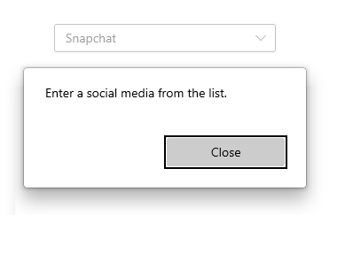

# Editing in WinUI ComboBox

The ComboBox control supports both editable and non-editable text boxes for selecting an item from a data source. To enable editing functionality, set [IsEditable](https://help.syncfusion.com/cr/winui/Syncfusion.UI.Xaml.Editors.SfComboBox.html#Syncfusion_UI_Xaml_Editors_SfComboBox_IsEditable) property as `true`. The default value is false.

## Editable ComboBox

In editable mode, the ComboBox allows users to edit in the text box that shows the suggestions in a drop-down list based on the input.




<editors:SfComboBox x:Name="sfComboBox"
                    Width="250"
                    IsEditable="true"
                    ItemsSource="{Binding SocialMedias}"
                    DisplayMemberPath="Name"
                    TextMemberPath="Name">
</editors:SfComboBox>





sfComboBox.IsEditable = true;




## Non-editable ComboBox

Non-editable mode prevents users from editing and instead allows them to select from drop-down list.




<editors:SfComboBox x:Name="sfComboBox"
                    Width="250"
                    IsEditable="false"
                    ItemsSource="{Binding SocialMedias}"
                    DisplayMemberPath="Name"
                    TextMemberPath="Name">
</editors:SfComboBox>





sfComboBox.IsEditable = false;




## Hide clear button in the editor

By default, the clear button `X` will be displayed in the editor of the `ComboBox` control, which can be used to clear the entered input. Hide the clear button in `ComboBox` control using the [ShowClearButton](https://help.syncfusion.com/cr/winui/Syncfusion.UI.Xaml.Editors.SfDropDownListBase.html#Syncfusion_UI_Xaml_Editors_SfDropDownListBase_ShowClearButton) property. The default value of `ShowClearButton` property value is **true**.




<editors:SfComboBox x:Name="sfComboBox"
                    Width="250"
                    IsEditable="true"
                    ShowClearButton="false"
                    ItemsSource="{Binding SocialMedias}"
                    DisplayMemberPath="Name"
                    TextMemberPath="Name">
</editors:SfComboBox>





sfComboBox.ShowClearButton = false;




N> The `ShowClearButton` property has no effect in non-editable mode.

## Open a drop-down programmatically

In SfComboBox control, the drop-down can be opened or closed programmatically by using the [IsDropDownOpen](https://help.syncfusion.com/cr/winui/Syncfusion.UI.Xaml.Editors.SfDropDownListBase.html#Syncfusion_UI_Xaml_Editors_SfDropDownListBase_IsDropDownOpen) property. The default value of `IsDropDownOpen` property is false. The following example shows how to open the drop-down when pressing alphabet keys in SfComboBox control.




<editors:SfComboBox x:Name="sfComboBox"
                    Width="250"
                    IsEditable="true"
                    PreviewKeyDown="OnEditingComboBoxPreviewKeyDown"
                    ItemsSource="{Binding SocialMedias}"
                    DisplayMemberPath="Name"
                    TextMemberPath="Name">
</editors:SfComboBox>





private void OnEditingComboBoxPreviewKeyDown(object sender, KeyRoutedEventArgs eventArgs)
{
    // Opening drop down when pressing alphabet keys.
    if (!sfComboBox.IsDropDownOpen && (int)eventArgs.Key >= 65 && (int)eventArgs.Key <= 90)
    {
        sfComboBox.IsDropDownOpen = true;
    }
}




## Handle invalid input 

The [TextSubmitted](https://help.syncfusion.com/cr/winui/Syncfusion.UI.Xaml.Editors.SfComboBox.html#Syncfusion_UI_Xaml_Editors_SfComboBox_TextSubmitted) event is triggered, when some text is submitted that does not correspond to an item in the ComboBox drop-down list. By using the following code sample, a dialogue box will be displayed when submitting input that does not contain in drop-down list.




<editors:SfComboBox x:Name="sfComboBox"
                    Width="250"
                    IsEditable="true"
                    ItemsSource="{Binding SocialMedias}"
                    TextSubmitted="OnEditingComboBoxTextSubmitted"
                    DisplayMemberPath="Name"
                    TextMemberPath="Name">
</editors:SfComboBox>





sfComboBox.TextSubmitted += OnEditingComboBoxTextSubmitted;




The TextSubmitted event can be handled as follows.




/// 

/// Occurs when the user submits some text that does not correspond to an item in the ComboBox drop-down list.
/// 

private async void OnEditingComboBoxTextSubmitted(object sender, Syncfusion.UI.Xaml.Editors.ComboBoxInputSubmittedEventArgs e)
{
    var cd = new ContentDialog
    {
        Content = "Enter a social media from the list.",
        CloseButtonText = "Close"
    };

    cd.XamlRoot = this.Content.XamlRoot;
    var result = await cd.ShowAsync();
}




