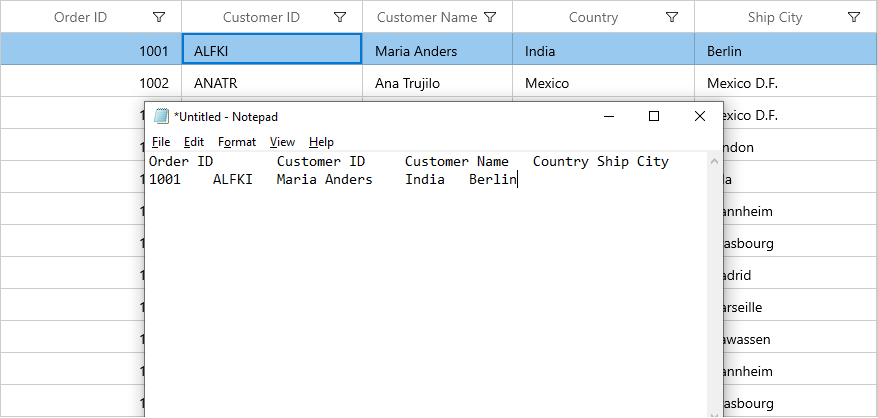
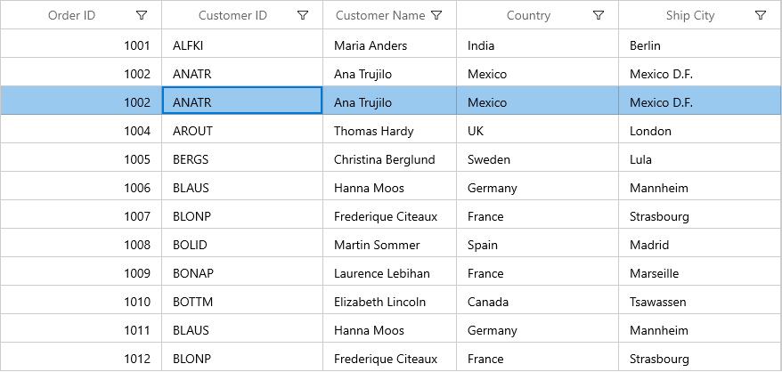
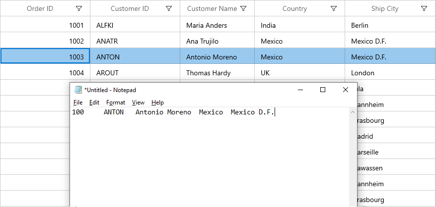
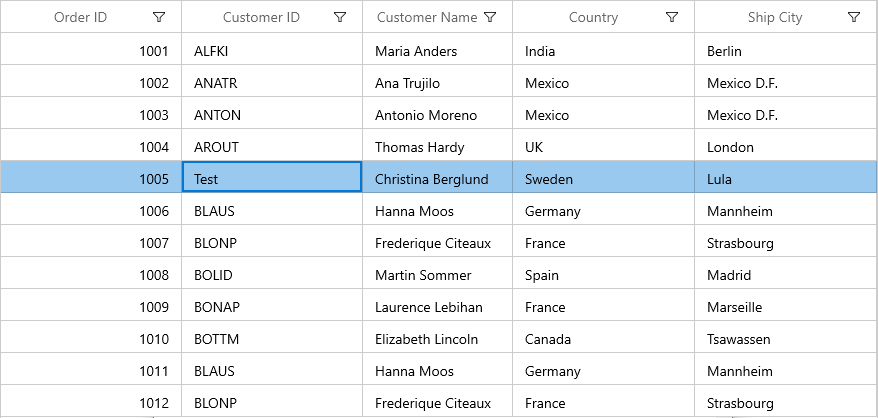
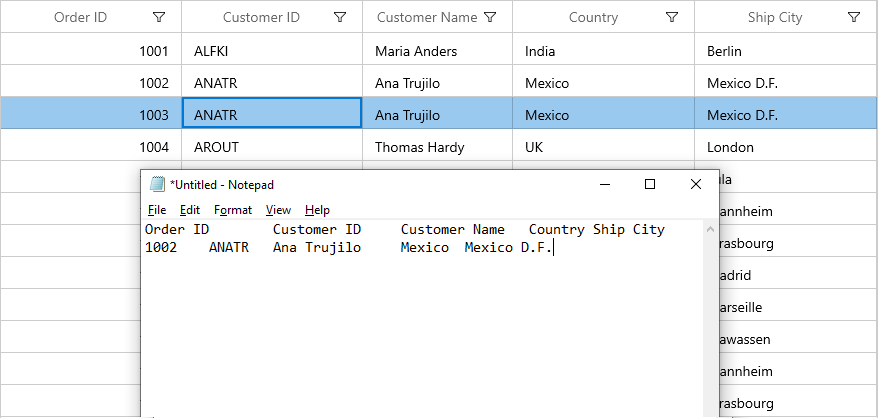

# Clipboard Operations in WinUI DataGrid

SfDataGrid provide support for the clipboard operations such as cut, copy and paste the data within control and between other applications such as Notepad, Excel. Clipboard operations copy and paste is enabled by default. You can copy selected records/cells from SfDataGrid by pressing <kbd>Ctrl+C</kbd> and also can paste the content from [Clipboard](https://docs.microsoft.com/en-us/uwp/api/Windows.ApplicationModel.DataTransfer.Clipboard?view=winrt-19041) to SfDataGrid by pressing <kbd>Ctrl+V</kbd>.

N> Clipboard operations is not supported for the summary rows, add new row, filter row and unbound rows.

 
## Copy to Clipboard in DataGrid

Copy operation works based on [CopyOption](https://help.syncfusion.com/cr/winui/Syncfusion.UI.Xaml.Grids.SfGridBase.html#Syncfusion_UI_Xaml_Grids_SfGridBase_CopyOption) property. 
`CopyOption` provides the following options,

* [None](https://help.syncfusion.com/cr/winui/Syncfusion.UI.Xaml.Grids.GridCopyOptions.html#Syncfusion_UI_Xaml_Grids_GridCopyOptions_None) – Disables copy in SfDataGrid.

* [CopyData](https://help.syncfusion.com/cr/winui/Syncfusion.UI.Xaml.Grids.GridCopyOptions.html#Syncfusion_UI_Xaml_Grids_GridCopyOptions_CopyData) – Enables copy in SfDataGrid.

* [IncludeHeaders](https://help.syncfusion.com/cr/winui/Syncfusion.UI.Xaml.Grids.GridCopyOptions.html#Syncfusion_UI_Xaml_Grids_GridCopyOptions_IncludeHeaders) – Column header also copied along with data.
 
* [IncludeFormat](https://help.syncfusion.com/cr/winui/Syncfusion.UI.Xaml.Grids.GridCopyOptions.html#Syncfusion_UI_Xaml_Grids_GridCopyOptions_IncludeFormat) – Copies the display text with format instead of actual value.
 
* [IncludeHiddenColumn](https://help.syncfusion.com/cr/winui/Syncfusion.UI.Xaml.Grids.GridCopyOptions.html#Syncfusion_UI_Xaml_Grids_GridCopyOptions_IncludeHiddenColumn) – Hidden column also copied to clipboard.
 
You have to use `IncludeHeaders`, `IncludeFormat`, `IncludeHiddenColumn` options along with `CopyData` option.



<dataGrid:SfDataGrid x:Name="sfDataGrid"
                       SelectionUnit="Row"
                       SelectionMode="Single"
                       CopyOption="CopyData,IncludeHeaders" 
                       ItemsSource="{Binding Orders}"/>


this.sfDataGrid.CopyOption = GridCopyOptions.CopyData | GridCopyOptions.IncludeHeaders;



N> `IncludeHiddenColumn` is not supported when [SelectionUnit](https://help.syncfusion.com/cr/winui/Syncfusion.UI.Xaml.Grids.GridSelectionUnit.html) is [Cell](https://help.syncfusion.com/cr/winui/Syncfusion.UI.Xaml.Grids.GridSelectionUnit.html#Syncfusion_UI_Xaml_Grids_GridSelectionUnit_Cell).

## Paste from Clipboard in DataGrid

Paste operation works based on [PasteOption](https://help.syncfusion.com/cr/winui/Syncfusion.UI.Xaml.Grids.SfGridBase.html#Syncfusion_UI_Xaml_Grids_SfGridBase_PasteOption) property. 
`PasteOption` provides the following options,

* [None](https://help.syncfusion.com/cr/winui/Syncfusion.UI.Xaml.Grids.GridPasteOptions.html#Syncfusion_UI_Xaml_Grids_GridPasteOptions_None) – Disable paste in SfDataGrid.

* [PasteData](https://help.syncfusion.com/cr/winui/Syncfusion.UI.Xaml.Grids.GridPasteOptions.html#Syncfusion_UI_Xaml_Grids_GridPasteOptions_PasteData) – Enabled paste in SfDataGrid and when an incompatible value is pasted into a record/cell, the pasting operation is skipped for that particular record/cell.

* [ExcludeFirstLine](https://help.syncfusion.com/cr/winui/Syncfusion.UI.Xaml.Grids.GridPasteOptions.html#Syncfusion_UI_Xaml_Grids_GridPasteOptions_ExcludeFirstLine) – This can be used when pasting data copied with `IncludeHeaders` copy option.
 
* [IncludeHiddenColumn](https://help.syncfusion.com/cr/winui/Syncfusion.UI.Xaml.Grids.GridPasteOptions.html#Syncfusion_UI_Xaml_Grids_GridPasteOptions_IncludeHiddenColumn)  – Paste the values in hidden columns also.

You have to use `ExcludeFirstLine`, `IncludeHiddenColumn` options along with `PasteData` option.



<dataGrid:SfDataGrid x:Name="sfDataGrid"
                       SelectionUnit="Row"
                       SelectionMode="Single"
                       GridPasteOption="PasteData,ExcludeFirstLine" 
                       ItemsSource="{Binding Orders}"/>


this.sfDataGrid.PasteOption = GridPasteOptions.PasteData | GridPasteOptions.ExcludeFirstLine;



## Cut to Clipboard in DataGrid

Cut operation works based on `CopyOption` property. `CopyOption` provides the following options,

* [None](https://help.syncfusion.com/cr/winui/Syncfusion.UI.Xaml.Grids.GridCopyOptions.html#Syncfusion_UI_Xaml_Grids_GridCopyOptions_None) – Disables cut in SfDataGrid.

* [CutData](https://help.syncfusion.com/cr/winui/Syncfusion.UI.Xaml.Grids.GridCopyOptions.html#Syncfusion_UI_Xaml_Grids_GridCopyOptions_CutData) – Enables cut in SfDataGrid.

* [IncludeHeaders](https://help.syncfusion.com/cr/winui/Syncfusion.UI.Xaml.Grids.GridCopyOptions.html#Syncfusion_UI_Xaml_Grids_GridCopyOptions_IncludeHeaders) – Column header also copied along with data.
 
* [IncludeFormat](https://help.syncfusion.com/cr/winui/Syncfusion.UI.Xaml.Grids.GridCopyOptions.html#Syncfusion_UI_Xaml_Grids_GridCopyOptions_IncludeFormat) – Cut the display text with format instead of actual value.
 
* [IncludeHiddenColumn](https://help.syncfusion.com/cr/winui/Syncfusion.UI.Xaml.Grids.GridCopyOptions.html#Syncfusion_UI_Xaml_Grids_GridCopyOptions_IncludeHiddenColumn) – Hidden column also cut to clipboard.
 
You have to use `IncludeHeaders`, `IncludeFormat`, `IncludeHiddenColumn` options along with `CutData` option.



<dataGrid:SfDataGrid x:Name="sfDataGrid"
                       SelectionUnit="Row"
                       SelectionMode="Single"
                       GridCopyOption="CutData,IncludeHeaders" 
                       ItemsSource="{Binding Orders}"/>


this.sfDataGrid.CopyOption = GridCopyOptions.CutData | GridCopyOptions.IncludeHeaders;



N> `IncludeHiddenColumn` is not supported when `SelectionUnit` is `Cell`.

## Events

### GridCopyContent

[GridCopyContent](https://help.syncfusion.com/cr/winui/Syncfusion.UI.Xaml.DataGrid.SfDataGrid.html#Syncfusion_UI_Xaml_DataGrid_SfDataGrid_GridCopyContent) event occurs when copy/cut the cells in SfDataGrid. [GridCopyPasteEventArgs](https://help.syncfusion.com/cr/winui/Syncfusion.UI.Xaml.Grids.GridCopyPasteEventArgs.html) provides information for `GridCopyContent` event. You can cancel copy operation by handling this event.



this.sfDataGrid.GridCopyContent += sfDataGrid_GridCopyContent;

void sfDdataGrid_GridCopyContent(object sender, GridCopyPasteEventArgs e)
{
    if (((e.OriginalSender as SfDataGrid).SelectedItem as OrderInfo).OrderID == 1004)
        e.Handled = true;
}



### GridPasteContent

[GridPasteContent](https://help.syncfusion.com/cr/winui/Syncfusion.UI.Xaml.DataGrid.SfDataGrid.html#Syncfusion_UI_Xaml_DataGrid_SfDataGrid_GridPasteContent) event occurs when paste the clipboard value into SfDataGrid. [GridCopyPasteEventArgs](https://help.syncfusion.com/cr/winui/Syncfusion.UI.Xaml.Grids.GridCopyPasteEventArgs.html) provides information for `GridPasteContent` event. You can cancel paste operation by handling this event.



this.sfDataGrid.GridPasteContent += sfDataGrid_GridPasteContent;

void sfDataGrid_GridPasteContent(object sender, GridCopyPasteEventArgs e)
{
    if (((e.OriginalSender as SfDataGrid).SelectedItem as OrderInfo).OrderID == 1010)
        e.Handled = true;
}



### CopyGridCellContent

[CopyGridCellContent](https://help.syncfusion.com/cr/winui/Syncfusion.UI.Xaml.DataGrid.SfDataGrid.html#Syncfusion_UI_Xaml_DataGrid_SfDataGrid_CopyGridCellContent) event occurs when cell being copy/cut. [GridCopyPasteCellEventArgs](https://help.syncfusion.com/cr/winui/Syncfusion.UI.Xaml.Grids.GridCopyPasteCellEventArgs.html) provides information for `CopyGridCellContent` event, which has following members,

* [ClipBoardValue](https://help.syncfusion.com/cr/winui/Syncfusion.UI.Xaml.Grids.GridCopyPasteCellEventArgs.html#Syncfusion_UI_Xaml_Grids_GridCopyPasteCellEventArgs_ClipBoardValue) - Returns cell value.

* [Column](https://help.syncfusion.com/cr/winui/Syncfusion.UI.Xaml.Grids.GridCopyPasteCellEventArgs.html#Syncfusion_UI_Xaml_Grids_GridCopyPasteCellEventArgs_Column) – Returns corresponding GridColumn of a cell.

* [RowData](https://help.syncfusion.com/cr/winui/Syncfusion.UI.Xaml.Grids.GridCopyPasteCellEventArgs.html#Syncfusion_UI_Xaml_Grids_GridCopyPasteCellEventArgs_RowData) – Returns corresponding RowData of a cell.

* [OriginalSender](https://help.syncfusion.com/cr/winui/Syncfusion.UI.Xaml.Grids.GridEventArgs.html#Syncfusion_UI_Xaml_Grids_GridEventArgs_OriginalSender) – Returns the SfDataGrid.

You can change the text copied to clipboard by changing the `ClipBoardValue`.
 


this.sfDataGrid.CopyGridCellContent += sfDataGrid_CopyGridCellContent;

void sfDataGrid_CopyGridCellContent(object sender, GridCopyPasteCellEventArgs e)
{
}



The below code example changes the clipboard value as 100 instead of cell value 1003 in SfDataGrid.



void sfDataGrid_CopyGridCellContent(object sender, GridCopyPasteCellEventArgs e)
{
    if (e.Column.MappingName == "OrderID" && (e.RowData as OrderInfo).OrderID == 1003)
        e.ClipBoardValue = 100;
}



The below code example handled the copy operation when `MappingName` of a Column is Country.



void sfDataGrid_CopyGridCellContent(object sender, GridCopyPasteCellEventArgs e)
{
    if (e.Column.MappingName == "Country")
        e.Handled = true;
}



### PasteGridCellContent

[PasteGridCellContent](https://help.syncfusion.com/cr/winui/Syncfusion.UI.Xaml.DataGrid.SfDataGrid.html#Syncfusion_UI_Xaml_DataGrid_SfDataGrid_PasteGridCellContent) event occurs when cell being paste. [GridCopyPasteCellEventArgs](https://help.syncfusion.com/cr/winui/Syncfusion.UI.Xaml.Grids.GridCopyPasteCellEventArgs.html) provides information for `PasteGridCellContent` event, which has following members.

* [ClipBoardValue](https://help.syncfusion.com/cr/winui/Syncfusion.UI.Xaml.Grids.GridCopyPasteCellEventArgs.html#Syncfusion_UI_Xaml_Grids_GridCopyPasteCellEventArgs_ClipBoardValue) - Returns clipboard value of a particular cell.

* [Column](https://help.syncfusion.com/cr/winui/Syncfusion.UI.Xaml.Grids.GridCopyPasteCellEventArgs.html#Syncfusion_UI_Xaml_Grids_GridCopyPasteCellEventArgs_Column) – Returns corresponding GridColumn of a cell.

* [RowData](https://help.syncfusion.com/cr/winui/Syncfusion.UI.Xaml.Grids.GridCopyPasteCellEventArgs.html#Syncfusion_UI_Xaml_Grids_GridCopyPasteCellEventArgs_RowData) – Returns corresponding RowData of a cell.

* [OriginalSender](https://help.syncfusion.com/cr/winui/Syncfusion.UI.Xaml.Grids.GridEventArgs.html#Syncfusion_UI_Xaml_Grids_GridEventArgs_OriginalSender) – Returns the SfDataGrid.

You can change the text paste to SfDataGrid by changing the `ClipBoardValue`.



this.sfDataGrid.PasteGridCellContent += sfDataGrid_PasteGridCellContent;

void sfDataGrid_PasteGridCellContent(object sender, GridCopyPasteCellEventArgs e)
{
}



The below code example change the clipboard value as Test instead of clipboard value BERGS.



void sfDataGrid_PasteGridCellContent(object sender, GridCopyPasteCellEventArgs e)
{
    if (e.Column.MappingName == "CustomerID" && (e.RowData as OrderInfo).CustomerID == "BERGS")
        e.ClipBoardValue = "Test";
}



The below code example handled the paste operation when `MappingName` of Column is OrderID



void sfDataGrid_PasteGridCellContent(object sender, GridCopyPasteCellEventArgs e)
{
    if (e.Column.MappingName == "OrderID")
        e.Handled = true;
}



## Handling Programmatically

### Programmatically Copy to Clipboard in WinUI DataGrid

Copy the selected records/cells in SfDataGrid by using [Copy](https://help.syncfusion.com/cr/winui/Syncfusion.UI.Xaml.DataGrid.IDataGridClipboardController.html#Syncfusion_UI_Xaml_DataGrid_IDataGridClipboardController_Copy) method in [ClipboardController](https://help.syncfusion.com/cr/winui/Syncfusion.UI.Xaml.DataGrid.SfDataGrid.html#Syncfusion_UI_Xaml_DataGrid_SfDataGrid_ClipboardController) of SfDataGrid.



this.sfDataGrid.ClipboardController.Copy();



Copy a record by selecting the record using [MoveCurrentCell](https://help.syncfusion.com/cr/winui/Syncfusion.UI.Xaml.DataGrid.GridSelectionController.html#Syncfusion_UI_Xaml_DataGrid_GridSelectionController_MoveCurrentCell_Syncfusion_UI_Xaml_Grids_ScrollAxis_RowColumnIndex_System_Boolean_) method and `Copy` method in `ClipboardController` of SfDataGrid.



RowColumnIndex rowColumnIndex = new RowColumnIndex();
rowColumnIndex.RowIndex = 2;
rowColumnIndex.ColumnIndex = 2;
this.sfDataGrid.SelectionController.MoveCurrentCell(rowColumnIndex);
this.sfDataGrid.ClipboardController.Copy();



Copy the multiple records by selecting group of records using [SelectRows](https://help.syncfusion.com/cr/winui/Syncfusion.UI.Xaml.DataGrid.GridSelectionController.html#Syncfusion_UI_Xaml_DataGrid_GridSelectionController_SelectRows_System_Int32_System_Int32_) method and `Copy` method in `ClipboardController` of SfDataGrid.



this.sfDataGrid.SelectionController.SelectRows(1, 7);
this.sfDataGrid.ClipboardController.Copy();



Copy the multiple cells by selecting group of cells using [SelectCells](https://help.syncfusion.com/cr/winui/Syncfusion.UI.Xaml.DataGrid.GridCellSelectionController.html#Syncfusion_UI_Xaml_DataGrid_GridCellSelectionController_SelectCells_System_Object_Syncfusion_UI_Xaml_DataGrid_GridColumn_System_Object_Syncfusion_UI_Xaml_DataGrid_GridColumn_System_Boolean_) method and `Copy` method in `ClipboardController` of SfDataGrid.



this.sfDataGrid.SelectCells(this.sfDataGrid.View.Records[2].Data, this.sfDataGrid.Columns[1],
this.sfDataGrid.View.Records[5].Data, this.sfDataGrid.Columns[3]);
this.sfDataGrid.ClipboardController.Copy();



### Copy rows without selecting in WinUI DataGrid

You can copy the records without selection by using [CopyRowsToClipboard](https://help.syncfusion.com/cr/winui/Syncfusion.UI.Xaml.DataGrid.IDataGridClipboardController.html#Syncfusion_UI_Xaml_DataGrid_IDataGridClipboardController_CopyRowsToClipboard_System_Int32_System_Int32_) method in `ClipboardController` of SfDataGrid.
 


this.sfDataGrid.ClipboardController.CopyRowsToClipboard(2, 4);



### Programmatically Cut Data to Clipboard in WinUI DataGrid

Cut the selected records/cells in SfDataGrid by using [Cut](https://help.syncfusion.com/cr/winui/Syncfusion.UI.Xaml.DataGrid.IDataGridClipboardController.html#Syncfusion_UI_Xaml_DataGrid_IDataGridClipboardController_Cut) method in `ClipboardController` of SfDataGrid.



this.sfDataGrid.ClipboardController.Cut();



Cut the entire record in SfDataGrid by selecting whole SfDataGrid using [SelectAll](https://help.syncfusion.com/cr/winui/Syncfusion.UI.Xaml.DataGrid.GridSelectionController.html#Syncfusion_UI_Xaml_DataGrid_GridSelectionController_SelectAll_System_Boolean_) method and `Cut` method in `ClipboardController` of SfDataGrid.



this.sfDataGrid.SelectionController.SelectAll();
this.sfDataGrid.ClipboardController.Cut();



Cut the data column in SfDataGrid by using [SelectCells](https://help.syncfusion.com/cr/wpf/Syncfusion.UI.Xaml.Grid.SfDataGrid.html#Syncfusion_UI_Xaml_Grid_SfDataGrid_SelectCells_System_Object_Syncfusion_UI_Xaml_Grid_GridColumn_System_Object_Syncfusion_UI_Xaml_Grid_GridColumn_System_Boolean_) method and `Cut` method in `ClipboardController` of SfDataGrid.



object firstRecord = null, lastRecord = null;

var recordIndex1 = this.sfDataGrid.ResolveToRecordIndex(2);
var recordIndex2 = this.sfDataGrid.ResolveToRecordIndex(12);

if (this.sfDataGrid.View.GroupDescriptions.Count > 0)
{
    var displayElement1 = this.sfDataGrid.View.TopLevelGroup.DisplayElements[recordIndex1];
    if (displayElement1 is RecordEntry)
        firstRecord = ((RecordEntry)displayElement1).Data;

    var displayElement2 = this.sfDataGrid.View.TopLevelGroup.DisplayElements[recordIndex2];
    if (displayElement2 is RecordEntry)
        lastRecord = ((RecordEntry)displayElement2).Data;
}
else
{
    firstRecord = this.sfDataGrid.View.Records[recordIndex1].Data;
    lastRecord = this.sfDataGrid.View.Records[recordIndex2].Data;
}

var firstColumn = this.sfDataGrid.Columns[3];
var lastColumn = this.sfDataGrid.Columns[3];
this.sfDataGrid.SelectCells(firstRecord, firstColumn, lastRecord, lastColumn);
this.sfDataGrid.ClipboardController.Cut();



### Programmatically Paste in DataGrid   

Paste the clipboard value into SfDataGrid by using [Paste](https://help.syncfusion.com/cr/winui/Syncfusion.UI.Xaml.DataGrid.IDataGridClipboardController.html#Syncfusion_UI_Xaml_DataGrid_IDataGridClipboardController_Paste) method in `ClipboardController` of SfDataGrid.



this.sfDataGrid.ClipboardController.Paste();



Paste the clipboard value into selected record by selecting the record using `MoveCurrentCell` method and `Paste` method in `ClipboardController` of SfDataGrid.



RowColumnIndex rowColumnIndex = new RowColumnIndex();
rowColumnIndex.RowIndex = 1;
rowColumnIndex.ColumnIndex = 1;
this.sfDataGrid.SelectionController.MoveCurrentCell(rowColumnIndex);
this.sfDataGrid.ClipboardController.Paste();



## Customizing Copy Paste Behavior in WinUI DataGrid

SfDataGrid process the clipboard operations in [DataGridClipboardController](https://help.syncfusion.com/cr/winui/Syncfusion.UI.Xaml.DataGrid.DataGridClipboardController.html) class. You can customize the default copy paste behaviors by overriding `DataGridClipboardController` class and set it to `SfDataGrid.ClipboardController`.



public class CustomCopyPaste : DataGridClipboardController
{

    public CustomCopyPaste(SfDataGrid dataGrid) : base(dataGrid)
    {        
    }
}





public MainWindow()
{
    InitializeComponent();
    this.sfDataGrid.ClipboardController = new CustomCopyPaste(this.sfDataGrid);
}



### Paste a cell into many cells in WinUI DataGrid

By default, you can copy one cell and paste it into another cell when Cell Selection is enabled in SfDataGrid. The below code shows how to copy one cell and paste it into all the selected cells by overriding [PasteToCell](https://help.syncfusion.com/cr/winui/Syncfusion.UI.Xaml.DataGrid.DataGridClipboardController.html#Syncfusion_UI_Xaml_DataGrid_DataGridClipboardController_PasteToCell_System_Object_Syncfusion_UI_Xaml_DataGrid_GridColumn_System_Object_) method in `DataGridClipboardController` class.



public class CustomCopyPaste : DataGridClipboardController
{
    private SfDataGrid sfDataGrid;

    public CustomCopyPaste(SfDataGrid dataGrid) : base(dataGrid)
    {
        sfDataGrid = dataGrid;
    }

    async protected override void PasteToCell(object record, GridColumn column, object value)
    {
        DataPackageView dataPackageView = Clipboard.GetContent();
        String text = null;

        if (dataPackageView.Contains(StandardDataFormats.Text))
            text = await dataPackageView.GetTextAsync();

        string[] clipBoardText = Regex.Split(text, @"\r\n");
        clipBoardText = Regex.Split(clipBoardText[0], @"\t");

        //Gets the clipBoardText and checks whether the clipBoardText is more than one cell or not.
        //Calls the base.

        if (clipBoardText.Count() > 1)
        {
            base.PasteToCell(record, column, value);
            return;
        }

        //Gets the selectedCells for paste the copied cell 
        var selectedCells = this.sfDataGrid.GetSelectedCells();
        int selectedCellsCount = selectedCells.Count;

        for (int i = 0; i < selectedCellsCount; i++)
        {
            record = selectedCells[i].RowData;
            column = selectedCells[i].Column;

            //Calls the PasteToCell method with particular record of selectedCells.
            // Column of selected records and rowData.
            base.PasteToCell(record, column, value);
        }            
    }
}



### Paste a record into many rows in WinUI DataGrid

By default, you can able to copy one row and paste it into another row when Row Selection is enabled in SfDataGrid. The below code shows how to copy one row and paste it into all selected rows by overriding the [PasteToRow](https://help.syncfusion.com/cr/winui/Syncfusion.UI.Xaml.DataGrid.DataGridClipboardController.html#Syncfusion_UI_Xaml_DataGrid_DataGridClipboardController_PasteToRow_System_Object_System_Object_) method in the `DataGridClipboardController` class.



public class CustomCopyPaste : DataGridClipboardController
{
    private SfDataGrid sfDataGrid;

    public CustomCopyPaste(SfDataGrid dataGrid) : base(dataGrid)
    {
        sfDataGrid = dataGrid;
    }       

    async protected override void PasteToRow(object clipboardcontent, object selectedRecords)
    {
        DataPackageView dataPackageView = Clipboard.GetContent();
        String text = null;

        if (dataPackageView.Contains(StandardDataFormats.Text))
            text = await dataPackageView.GetTextAsync();

        string[] clipBoardText = Regex.Split(text, @"\r\n");            

        //Gets the clipBoardText and checks whether the clipBoardText is more than one row or not.
        //Calls the base.

        if (clipBoardText.Count() > 1)
        {
            base.PasteToRow(clipboardcontent, selectedRecords);
            return;
        }

        var selectedRecord = this.sfDataGrid.SelectedItems;

        for (int i = 0; i < selectedRecord.Count; i++)
        {
            //Gets the Selected records for paste the copied row.
            selectedRecords = selectedRecord[i];

            // Calls the PasteToRow method with copiedRecord and selectedRecord.
            base.PasteToRow(clipboardcontent, selectedRecords);
        }            
    }
}



### Select pasted records in WinUI DataGrid

By default after pasting the clipboard value to SfDataGrid selection is maintains in previously selected records as it is. The below code shows select the pasted records after the Paste operation, by overriding the [PasteToRows](https://help.syncfusion.com/cr/winui/Syncfusion.UI.Xaml.DataGrid.DataGridClipboardController.html#Syncfusion_UI_Xaml_DataGrid_DataGridClipboardController_PasteToRows_System_Object_) and [PasteToRow](https://help.syncfusion.com/cr/winui/Syncfusion.UI.Xaml.DataGrid.DataGridClipboardController.html#Syncfusion_UI_Xaml_DataGrid_DataGridClipboardController_PasteToRow_System_Object_System_Object_) methods in `DataGridClipboardController` class. This code is applicable when [SelectionUnit](https://help.syncfusion.com/cr/winui/Syncfusion.UI.Xaml.DataGrid.SfDataGrid.html#Syncfusion_UI_Xaml_DataGrid_SfDataGrid_SelectionUnit) is [Row](https://help.syncfusion.com/cr/winui/Syncfusion.UI.Xaml.Grids.GridSelectionUnit.html#Syncfusion_UI_Xaml_Grids_GridSelectionUnit_Row).



public class CustomCopyPaste : DataGridClipboardController
{
    private SfDataGrid sfDataGrid;

    public CustomCopyPaste(SfDataGrid dataGrid) : base(dataGrid)
    {
        sfDataGrid = dataGrid;
    }

    //Creates the new list for add the selected records.
    public List<object> selectedItems = new List<object>();

    protected override void PasteToRow(object clipboardcontent, object selectedRecords)
    {
        //Adds the selected record to list.
        selectedItems.Add(selectedRecords);
        base.PasteToRow(clipboardcontent, selectedRecords);
    }

    protected override void PasteToRows(object clipboardrows)
    {
        base.PasteToRows(clipboardrows);

        //Uses the SelectionController to apply the selection for Pasted records.
        this.sfDataGrid.SelectionController.HandleGridOperations(new GridOperationsHandlerArgs(GridOperation.Paste, selectedItems));
    }        
}



### Create new records while pasting in WinUI DataGrid

By default while paste the clipboard value to SfDataGrid, it changes the values of the already existing records. The below code example shows how to add the copied records as new rows in SfDataGrid by overriding the `PasteToRows` method in `DataGridClipboardController` class.



public class CustomCopyPaste : DataGridClipboardController
{
    private SfDataGrid sfDataGrid;

    public CustomCopyPaste(SfDataGrid dataGrid) : base(dataGrid)
    {
        sfDataGrid = dataGrid;
    }

    //Creates the new list for add the selected records.
    public List<object> selectedItems = new List<object>();

    protected override void PasteToRows(object clipboardrows)
    {
        var copiedRecord = (string[])clipboardrows;
        int copiedRecordsCount = copiedRecord.Count();

        //Based on the clipboard count, the new record for paste is added.

        if (copiedRecordsCount > 0)
        {
            //Gets the viewModel for adding the record.
            var rec = this.sfDataGrid.DataContext as ViewModel;

            for (int i = 0; i < copiedRecordsCount; i++)
            {
                //Creates the new instance for Model, for adding the new record.
                OrderInfo entity = new OrderInfo();

                for (int j = 0; j < this.sfDataGrid.Columns.Count; j++)
                {
                    var record = copiedRecord[i];
                    string[] recd = Regex.Split(record, @"\t");

                    //Adds the new record by using PasteToCell method by passing the created data, particular column, and clipboard value.
                    this.PasteToCell(entity, this.sfDataGrid.Columns[j], recd[j]);
                }

                //Adds the pasted record in collection.
                rec.Orders.Add(entity);
            }
        }            
    }
}


