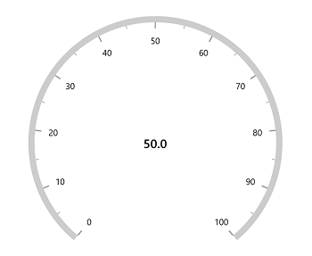
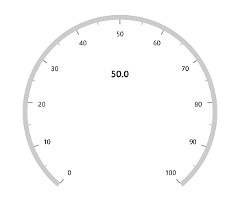
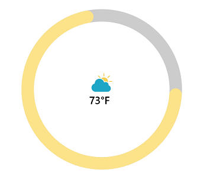
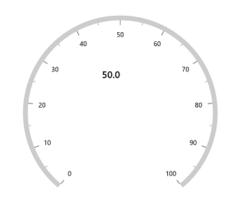

# Annotation in WinUI Radial Gauge

[`Radial axis`](https://help.syncfusion.com/cr/winui/Syncfusion.UI.Xaml.Gauges.RadialAxis.html) allows you to add multiple controls such as text, icon and image etc., as an annotation to a specific point of interest in the radial gauge.

The following properties are available in [`Annotation`](https://help.syncfusion.com/cr/winui/Syncfusion.UI.Xaml.Gauges.GaugeAnnotation.html) to customizes the position and alignment.

* [`DirectionValue`](https://help.syncfusion.com/cr/winui/Syncfusion.UI.Xaml.Gauges.GaugeAnnotation.html#Syncfusion_UI_Xaml_Gauges_GaugeAnnotation_DirectionValue) –  Specifies the value that indicates the direction of the annotation based on [`DirectionUnit`](https://help.syncfusion.com/cr/winui/Syncfusion.UI.Xaml.Gauges.GaugeAnnotation.html#Syncfusion_UI_Xaml_Gauges_GaugeAnnotation_DirectionUnit) property. 

* [`DirectionUnit`](https://help.syncfusion.com/cr/winui/Syncfusion.UI.Xaml.Gauges.GaugeAnnotation.html#Syncfusion_UI_Xaml_Gauges_GaugeAnnotation_DirectionUnit) – Specifies the value that indicates the direction of the annotation to be calculated on the basis of [`Axis value`](https://help.syncfusion.com/cr/winui/Syncfusion.UI.Xaml.Gauges.AnnotationDirection.html#Syncfusion_UI_Xaml_Gauges_AnnotationDirection_AxisValue) or [`Angle`](https://help.syncfusion.com/cr/winui/Syncfusion.UI.Xaml.Gauges.AnnotationDirection.html#Syncfusion_UI_Xaml_Gauges_AnnotationDirection_Angle).

* [`PositionFactor`](https://help.syncfusion.com/cr/winui/Syncfusion.UI.Xaml.Gauges.GaugeAnnotation.html#Syncfusion_UI_Xaml_Gauges_GaugeAnnotation_PositionFactor) – Specifies the factor value(from 0 to 1) to adjusts the annotation distance from center point.

* `HorizontalAlignment` – Specifies the horizontal alignment for positioning the annotation.

* `VerticalAlignment` – Specifies the vertical alignment for positioning the annotation.





<gauge:SfRadialGauge>
    <gauge:SfRadialGauge.Axes>
        <gauge:RadialAxis>
            <gauge:RadialAxis.Annotations>
                <gauge:GaugeAnnotation DirectionUnit="AxisValue"
                                       DirectionValue="50">
                    <gauge:GaugeAnnotation.Content>
                        <TextBlock Text="50.0"
                                   FontWeight="SemiBold"
                                   FontSize="20" />
                    </gauge:GaugeAnnotation.Content>
                </gauge:GaugeAnnotation>
            </gauge:RadialAxis.Annotations>
        </gauge:RadialAxis>
    </gauge:SfRadialGauge.Axes>
</gauge:SfRadialGauge>





SfRadialGauge sfRadialGauge = new SfRadialGauge();

RadialAxis radialAxis = new RadialAxis();
sfRadialGauge.Axes.Add(radialAxis);

GaugeAnnotation gaugeAnnotation = new GaugeAnnotation();
gaugeAnnotation.DirectionUnit = AnnotationDirection.AxisValue;
gaugeAnnotation.DirectionValue = 50;
gaugeAnnotation.Content = new TextBlock { Text = "50.0", FontWeight = FontWeights.SemiBold, FontSize = 20 };
radialAxis.Annotations.Add(gaugeAnnotation);

this.Content = sfRadialGauge;





## Positioning annotation

The annotation can be positioned using either the [`Angle`](https://help.syncfusion.com/cr/winui/Syncfusion.UI.Xaml.Gauges.AnnotationDirection.html#Syncfusion_UI_Xaml_Gauges_AnnotationDirection_Angle) or the [`Axis value`](https://help.syncfusion.com/cr/winui/Syncfusion.UI.Xaml.Gauges.AnnotationDirection.html#Syncfusion_UI_Xaml_Gauges_AnnotationDirection_AxisValue). It can be controlled by the [`DirectionUnit`](https://help.syncfusion.com/cr/winui/Syncfusion.UI.Xaml.Gauges.GaugeAnnotation.html#Syncfusion_UI_Xaml_Gauges_GaugeAnnotation_DirectionUnit) property of [`Annotation`](https://help.syncfusion.com/cr/winui/Syncfusion.UI.Xaml.Gauges.GaugeAnnotation.html). The default value is [`Angle`](https://help.syncfusion.com/cr/winui/Syncfusion.UI.Xaml.Gauges.AnnotationDirection.html#Syncfusion_UI_Xaml_Gauges_AnnotationDirection_Angle).

### Positioning annotation using angle

The following example shows how to position the annotation using angle.





 <gauge:SfRadialGauge>
     <gauge:SfRadialGauge.Axes>
         <gauge:RadialAxis>
             <gauge:RadialAxis.Pointers>
                 <gauge:NeedlePointer Value="90" />
             </gauge:RadialAxis.Pointers>
             <gauge:RadialAxis.Annotations>
                 <gauge:GaugeAnnotation DirectionValue="90"
                                        PositionFactor="0.5">
                     <gauge:GaugeAnnotation.Content>
                         <TextBlock Text="90.0"
                                    FontWeight="SemiBold"
                                    FontSize="20" />
                     </gauge:GaugeAnnotation.Content>
                 </gauge:GaugeAnnotation>
             </gauge:RadialAxis.Annotations>
         </gauge:RadialAxis>
     </gauge:SfRadialGauge.Axes>
 </gauge:SfRadialGauge>





SfRadialGauge sfRadialGauge = new SfRadialGauge();

RadialAxis radialAxis = new RadialAxis();
sfRadialGauge.Axes.Add(radialAxis);

NeedlePointer needlePointer = new NeedlePointer();
needlePointer.Value = 90;
radialAxis.Pointers.Add(needlePointer);

GaugeAnnotation gaugeAnnotation = new GaugeAnnotation();
gaugeAnnotation.DirectionValue = 90;
gaugeAnnotation.PositionFactor = 0.5;
gaugeAnnotation.Content = new TextBlock { Text = "90.0", FontWeight = FontWeights.SemiBold, FontSize = 20 };
radialAxis.Annotations.Add(gaugeAnnotation);

this.Content = sfRadialGauge;





### Positioning annotation using axis value

The following example shows how to position the annotation using axis value.





<gauge:SfRadialGauge>
    <gauge:SfRadialGauge.Axes>
        <gauge:RadialAxis>
            <gauge:RadialAxis.Annotations>
                <gauge:GaugeAnnotation DirectionUnit="AxisValue"
                                       DirectionValue="50"
                                       PositionFactor="0.4">
                     <gauge:GaugeAnnotation.Content>
                         <TextBlock Text="50.0"
                                    FontWeight="SemiBold"
                                    FontSize="20" />
                     </gauge:GaugeAnnotation.Content>
                </gauge:GaugeAnnotation>
            </gauge:RadialAxis.Annotations>
        </gauge:RadialAxis>
    </gauge:SfRadialGauge.Axes>
</gauge:SfRadialGauge>





SfRadialGauge sfRadialGauge = new SfRadialGauge();

RadialAxis radialAxis = new RadialAxis();
sfRadialGauge.Axes.Add(radialAxis);

GaugeAnnotation gaugeAnnotation = new GaugeAnnotation();
gaugeAnnotation.DirectionUnit = AnnotationDirection.AxisValue;
gaugeAnnotation.DirectionValue = 50;
gaugeAnnotation.PositionFactor = 0.4;
gaugeAnnotation.Content = new TextBlock { Text = "50.0", FontWeight = FontWeights.SemiBold, FontSize = 20 };
radialAxis.Annotations.Add(gaugeAnnotation);

this.Content = sfRadialGauge;





[`PositionFactor`](https://help.syncfusion.com/cr/winui/Syncfusion.UI.Xaml.Gauges.GaugeAnnotation.html#Syncfusion_UI_Xaml_Gauges_GaugeAnnotation_PositionFactor) is used to move the annotation from the center of axis to the edge of the axis. For example, when you specify the [`PositionFactor`](https://help.syncfusion.com/cr/winui/Syncfusion.UI.Xaml.Gauges.GaugeAnnotation.html#Syncfusion_UI_Xaml_Gauges_GaugeAnnotation_PositionFactor) as 0.5, the annotation will be moved from the center towards the corresponding direction with the distance of half of the radius value of axis.

By default, the value of [`PositionFactor`](https://help.syncfusion.com/cr/winui/Syncfusion.UI.Xaml.Gauges.GaugeAnnotation.html#Syncfusion_UI_Xaml_Gauges_GaugeAnnotation_PositionFactor) is 0.

## Setting image for annotation

Annotations provide options to add any image over the gauge control with respect to its offset position. You can add multiple images in a single control.





<gauge:SfRadialGauge>
    <gauge:SfRadialGauge.Axes>
        <gauge:RadialAxis Interval="10"
                          StartAngle="0"
                          EndAngle="360"
                          ShowTicks="False"
                          ShowLabels="False"
                          AxisLineWidth="30">

            <gauge:RadialAxis.Pointers>
                <gauge:RangePointer Value="73"
                                    PointerWidth="30"
                                    EnableAnimation="True"
                                    Background="#FFFCE38A"
                                    CornerStyle="BothCurve" />
            </gauge:RadialAxis.Pointers>

            <gauge:RadialAxis.Annotations>
                <gauge:GaugeAnnotation>
                    <gauge:GaugeAnnotation.Content>
                        <Grid>
                            <Grid.RowDefinitions>
                                <RowDefinition Height="*" />
                                <RowDefinition Height="Auto" />
                            </Grid.RowDefinitions>
                            <Image Source="CloudDownload.png"
                                   Height="50"
                                   Width="60" />
                            <TextBlock Text="73°F"
                                       Grid.Row="1"
                                       FontSize="25"
                                       FontWeight="SemiBold"
                                       VerticalAlignment="Top"
                                       HorizontalAlignment="Left" />
                        </Grid>
                    </gauge:GaugeAnnotation.Content>
                </gauge:GaugeAnnotation>
            </gauge:RadialAxis.Annotations>

        </gauge:RadialAxis>
    </gauge:SfRadialGauge.Axes>
</gauge:SfRadialGauge>





SfRadialGauge sfRadialGauge = new SfRadialGauge();

RadialAxis radialAxis = new RadialAxis();
radialAxis.Interval = 10;
radialAxis.StartAngle = 0;
radialAxis.EndAngle = 360;
radialAxis.ShowTicks = false;
radialAxis.ShowLabels = false;
radialAxis.AxisLineWidth = 30;
sfRadialGauge.Axes.Add(radialAxis);

RangePointer rangePointer = new RangePointer();
rangePointer.Value = 73;
rangePointer.PointerWidth = 30;
rangePointer.EnableAnimation = true;
rangePointer.Background = new SolidColorBrush(Color.FromArgb(255, 252, 227, 138));
rangePointer.CornerStyle = CornerStyle.BothCurve;
radialAxis.Pointers.Add(rangePointer);

Grid grid = new Grid();
grid.RowDefinitions.Add(new RowDefinition { Height = new GridLength { GridUnitType = GridUnitType.Star } });
grid.RowDefinitions.Add(new RowDefinition { Height = new GridLength { GridUnitType = GridUnitType.Auto } });

Image image = new Image();
BitmapImage bm = new BitmapImage();
bm.UriSource = new Uri("ms-appx:/CloudDownload.png", UriKind.Absolute);
image.Source = bm;
image.Height = 50;
image.Width = 60;
Grid.SetRow(image, 0);
grid.Children.Add(image);

TextBlock textBlock = new TextBlock();
textBlock.Text = "73°F";
textBlock.FontSize = 25;
textBlock.FontWeight = FontWeights.SemiBold;
textBlock.VerticalAlignment = VerticalAlignment.Top;
textBlock.HorizontalAlignment = HorizontalAlignment.Left;
Grid.SetRow(textBlock, 1);
grid.Children.Add(textBlock);

GaugeAnnotation gaugeAnnotation = new GaugeAnnotation();
gaugeAnnotation.Content = grid;
radialAxis.Annotations.Add(gaugeAnnotation);

this.Content = sfRadialGauge;





## Alignment of annotation

[`Annotation`](https://help.syncfusion.com/cr/winui/Syncfusion.UI.Xaml.Gauges.GaugeAnnotation.html) can be aligned to center, near and far using the `HorizontalAlignment` and `VerticalAlignment` properties of annotation.

The following code example demonstrates how to set the `HorizontalAlignment` for annotation





<gauge:SfRadialGauge>
    <gauge:SfRadialGauge.Axes>
        <gauge:RadialAxis>
            <gauge:RadialAxis.Annotations>
                <gauge:GaugeAnnotation DirectionUnit="AxisValue"
                                       DirectionValue="50"
                                       PositionFactor="0.4"
                                       HorizontalAlignment="Left">
                    <gauge:GaugeAnnotation.Content>
                        <TextBlock Text="50.0"
                                   FontWeight="SemiBold"
                                   FontSize="20" />
                    </gauge:GaugeAnnotation.Content>
                </gauge:GaugeAnnotation>
            </gauge:RadialAxis.Annotations>
        </gauge:RadialAxis>
    </gauge:SfRadialGauge.Axes>
</gauge:SfRadialGauge>





SfRadialGauge sfRadialGauge = new SfRadialGauge();

RadialAxis radialAxis = new RadialAxis();
sfRadialGauge.Axes.Add(radialAxis);

GaugeAnnotation gaugeAnnotation = new GaugeAnnotation();
gaugeAnnotation.DirectionUnit = AnnotationDirection.AxisValue;
gaugeAnnotation.DirectionValue = 50;
gaugeAnnotation.HorizontalAlignment = HorizontalAlignment.Left;
gaugeAnnotation.PositionFactor = 0.4;
gaugeAnnotation.Content = new TextBlock { Text = "50.0", FontWeight = FontWeights.SemiBold, FontSize = 20 };
radialAxis.Annotations.Add(gaugeAnnotation);

this.Content = sfRadialGauge;





The following code example demonstrates how to set `VerticalAlignment` for annotation,





<gauge:SfRadialGauge>
    <gauge:SfRadialGauge.Axes>
        <gauge:RadialAxis>
            <gauge:RadialAxis.Annotations>
                <gauge:GaugeAnnotation DirectionUnit="AxisValue"
                                       DirectionValue="50"
                                       PositionFactor="0.4"
                                       VerticalAlignment="Top">
                     <gauge:GaugeAnnotation.Content>
                         <TextBlock Text="50.0"
                                    FontWeight="SemiBold"
                                    FontSize="20" />
                     </gauge:GaugeAnnotation.Content>
            </gauge:RadialAxis.Annotations>
        </gauge:RadialAxis>
    </gauge:SfRadialGauge.Axes>
</gauge:SfRadialGauge>





SfRadialGauge sfRadialGauge = new SfRadialGauge();

RadialAxis radialAxis = new RadialAxis();
sfRadialGauge.Axes.Add(radialAxis);

GaugeAnnotation gaugeAnnotation = new GaugeAnnotation();
gaugeAnnotation.DirectionUnit = AnnotationDirection.AxisValue;
gaugeAnnotation.DirectionValue = 50;
gaugeAnnotation.VerticalAlignment = VerticalAlignment.Top;
gaugeAnnotation.PositionFactor = 0.4;
gaugeAnnotation.Content = new TextBlock { Text = "50.0", FontWeight = FontWeights.SemiBold, FontSize = 20 };
radialAxis.Annotations.Add(gaugeAnnotation);

this.Content = sfRadialGauge;





