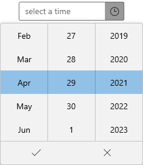

# Dropdown Customization in WinUI Time Picker

This section describes about various dropdown customization options available in [Time Picker](https://help.syncfusion.com/cr/winui/Syncfusion.UI.Xaml.Editors.SfTimePicker.html) control.

## Customize the dropdown button

You can customize the UI of dropdown button by using the [`DropDownButtonTemplate`](https://help.syncfusion.com/cr/winui/Syncfusion.UI.Xaml.Editors.SfDropDownBase.html#Syncfusion_UI_Xaml_Editors_SfDropDownBase_DropDownButtonTemplate) property. The `DataContext` of `DropDownButtonTemplate` property is `SfTimePicker`.




<Page.Resources>
    <x:String x:Key="flight">M11.294993,2L15.378997,14 15.277995,14 13.188995,14 9.1429941,14 7.6250149,14 6.9399958,14 6.0199964,11.5 3.2099977,11.5 4.725997,16.014 3.2099977,20.5 6.0199964,20.5 6.8039956,18 7.6250201,18 8.8379947,18 15.288014,18 15.365021,18.000015 11.436984,30.000015 14.368989,30.000015 20.100004,18.000015 20.273989,18.000015 27.989002,18C29.084003,18 29.975004,17.121 29.975004,15.96 29.975004,14.879 29.084003,14 27.989002,14L22.309006,14 20.211995,14 20.096004,14 14.368996,2z M8.6259891,0L15.719998,0 21.367719,12 27.989002,12C30.205004,12,32.001007,13.773,32.001007,15.96L32.001007,16.04C32.001007,18.227,30.205004,20,27.989002,20L21.366735,20 15.719025,32.000015 8.6260106,32.000015 12.536309,20 8.2531061,20 7.5219953,22.5 0,22.5 2.5709982,16.013 0,9.5 7.4539952,9.5 8.3923279,12 12.537137,12z</x:String>
</Page.Resources>

<editors:SfTimePicker
    x:Name="sfTimePicker"
    PlaceHolderText="pick a travel time">
    <editors:SfTimePicker.DropDownButtonTemplate>
        <DataTemplate>
            <Grid>
                <Path
                    Width="20"
                    Height="20"
                    Data="{StaticResource flight}"
                    Fill="{Binding Foreground, RelativeSource={RelativeSource Mode=TemplatedParent}}"
                    RenderTransformOrigin="0.5,0.5"
                    Stretch="Uniform" />
            </Grid>
        </DataTemplate>
    </editors:SfTimePicker.DropDownButtonTemplate>
</editors:SfTimePicker>




N> Download demo application from [GitHub](https://github.com/SyncfusionExamples/syncfusion-winui-tools-timepicker-examples/tree/main/Samples/SpinnerCustomUI)

## Hide dropdown button

You can hide the dropdown button in `Time Picker` by setting the [`ShowDropDownButton`](https://help.syncfusion.com/cr/winui/Syncfusion.UI.Xaml.Editors.SfDropDownBase.html#Syncfusion_UI_Xaml_Editors_SfDropDownBase_ShowDropDownButton) property value as `false`. The default value of `ShowDropDownButton` property is `true`.

N> To open a dropdown time spinner, press the `Alt` + `Down Arrow` keys.




<editors:SfTimePicker ShowDropDownButton="False" 
                      x:Name="sfTimePicker"/>




SfTimePicker sfTimePicker = new SfTimePicker();
sfTimePicker.ShowDropDownButton = false;




N> Download demo application from [GitHub](https://github.com/SyncfusionExamples/syncfusion-winui-tools-timepicker-examples/blob/main/Samples/ViewAndItemCustomization)

## Change dropdown alignment

You can change the alignment of the dropdown time spinner as full, center, left, right, top or bottom edge of the `Time Picker` by using the [`DropDownPlacement`](https://help.syncfusion.com/cr/winui/Syncfusion.UI.Xaml.Editors.SfDropDownBase.html#Syncfusion_UI_Xaml_Editors_SfDropDownBase_DropDownPlacement) property. The default value of `DropDownPlacement` property is `Auto`.

N> If you change the dropdown alignment by using `DropDownPlacement` property and there is not sufficient space, then `Time Picker` smartly shifts the spinner alignment.




<editors:SfTimePicker DropDownPlacement="BottomEdgeAlignedLeft" 
                      x:Name="sfTimePicker"/>




SfTimePicker sfTimePicker = new SfTimePicker();
sfTimePicker.DropDownPlacement = FlyoutPlacementMode.BottomEdgeAlignedLeft;




N> Download demo application from [GitHub](https://github.com/SyncfusionExamples/syncfusion-winui-tools-timepicker-examples/blob/main/Samples/ViewAndItemCustomization)

## Open dropdown programmatically

You can open or close the dropdown time spinner programmatically by setting [`IsOpen`](https://help.syncfusion.com/cr/winui/Syncfusion.UI.Xaml.Editors.SfDropDownBase.html#Syncfusion_UI_Xaml_Editors_SfDropDownBase_IsOpen) property value as **true** or **false**. The default value of `IsOpen` property is **false**.




<editors:SfTimePicker IsOpen="True"
                      x:Name="sfTimePicker"/>




SfTimePicker sfTimePicker = new SfTimePicker();
sfTimePicker.IsOpen = true;




N> Download demo application from [GitHub](https://github.com/SyncfusionExamples/syncfusion-winui-tools-timepicker-examples/tree/main/Samples/Localization)

## Change dropdown height

You can change the height of dropdown time spinner by using the [`DropDownHeight`](https://help.syncfusion.com/cr/winui/Syncfusion.UI.Xaml.Editors.SfDropDownBase.html#Syncfusion_UI_Xaml_Editors_SfDropDownBase_DropDownHeight) property. Based on the value of `DropDownHeight`, `ItemWidth` and `ItemHeight` properties, particular time cells to be visible. The default value of `DropDownHeight` property is `NaN`.




<editors:SfTimePicker DropDownHeight="200"
                      x:Name="sfTimePicker"/>




SfTimePicker sfTimePicker = new SfTimePicker();
sfTimePicker.DropDownHeight = 200;




N> Download demo application from [GitHub](https://github.com/SyncfusionExamples/syncfusion-winui-tools-timepicker-examples/blob/main/Samples/ViewAndItemCustomization)

## Change the number of time cells to be shown in the dropdown

You can change the number of dropdown cells to be shown in the dropdown time spinner by using the [`VisibleItemsCount`](https://help.syncfusion.com/cr/winui/Syncfusion.UI.Xaml.Editors.SfTimePicker.html#Syncfusion_UI_Xaml_Editors_SfTimePicker_VisibleItemsCount) property. The default value of `VisibleItemsCount` property is `-1`.

N> When `DropDownHeight` and `VisibleItemsCount` properties are set, `VisibleItemsCount` property have higher precedence.




<editors:SfTimePicker VisibleItemsCount="5" 
                      x:Name="sfTimePicker"/>




SfTimePicker sfTimePicker = new SfTimePicker();
sfTimePicker.VisibleItemsCount = 5




N> Download demo application from [GitHub](https://github.com/SyncfusionExamples/syncfusion-winui-tools-timepicker-examples/blob/main/Samples/TimeRestriction)

